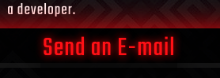

Karleigh Ponnock first react project. This project was bootstrapped with [Create React App](https://github.com/facebook/create-react-app).

### `npm start`
Runs the app in the development mode. 
Open [http://localhost:3000](http://localhost:3000) to view it in the browser.

# Project Name 
Karleigh Ponnock Portfolio

  ## Overview 
  This project is a simple portfolio using react. The main page is a bio with a photo of myself and a list of my skills. The portfolio page has a few hghlighted projects embedded using iFrame. Each sit can be externally accesses by clicking on the labeled hyperlink above each iFrame. In the bottom left hand corner of the footer links to my Github and LinkedIn can be accessed from any page.

  ## Table of Contents:
  - [Screenshots_and_GIFs](#Screenshots_and_GIFs)
  - [Motivation](#Motivation)
  - [Installation](#Installation)
  - [Credits](#Credits)

 ## Screenshots_and_GIFs 
  -  
  - 
  -   
  - 
  -   
  - 
  
  ## Motivation
  To give employers and clients a place to see my skill set using a number of technologies including  
  -HTML  
  -CSS   
  -React  
  -Javascript  
  to display more complex and diverse projects

  ## Installation 
  - npm i 

 # Access the app here: 
Deployed: https://karleighponnock.github.io/react-portfolio/

Github:https://karleighponnock.github.io/react-portfolio/

# Author
Karleigh Ponnock
Github: https://github.com/karleighponnock
LinkedIn: https://www.linkedin.com/in/karleigh-ponnock-3601421aa/

